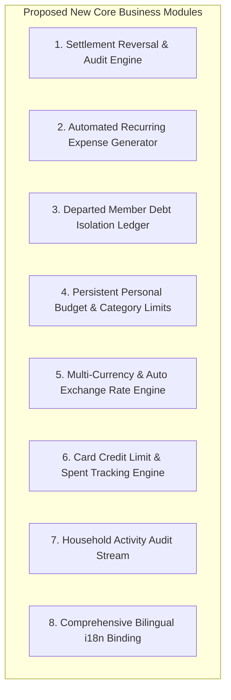

# GEMINI Business Logic Analysis: Broken Logics & New Proposed Business Logic

**Purpose**: Detailed audit of existing broken business logics, algorithmic flaws, data integrity edge cases, and specification of proposed new business logic features for the Home Finance Tracker.  
**Last Updated**: 2026-07-30  
**Current Status**: Complete Audit Report (Read-Only Analysis)  

---

## 1. Executive Overview

This document presents a deep-dive analysis of the **Home Finance Tracker** codebase. The application tracks shared household and personal expenses, computes minimal debt transfers using a cash-flow minimization solver, and manages payment channels, user profiles, and house memberships.

Our audit identified **10 Critical Broken Business Logics / Algorithmic Flaws** in the current implementation, alongside **8 Recommended New Business Logic Systems** to elevate the software to enterprise grade.

---

## 2. Broken Business Logics & Flaws Identified

### 2.1. User ID Disconnect (`activeUserId` vs `dbUserProfile.uid`)
* **Location**: `src/context/AuthContext.tsx`, `src/utils/settlementEngine.ts`, `src/components/AddExpenseModal.tsx`
* **Issue**: `activeUserId` uses static string keys (e.g. `'raiyan'`), whereas database profiles and house rosters use UIDs (e.g. `'user-raiyan-001'`).
* **Root Cause & Impact**: In `getHouseUsers()`, user IDs in the house roster are set to `m.uid` (`'user-raiyan-001'`). However, `AddExpenseModal` sets `paidBy` to `activeUserId` (`'raiyan'`). When `calculateNetBalances()` runs, key lookups between UIDs and static IDs can fail if display names differ or custom users register, causing expenses to be attributed to unknown IDs or ignored in balance calculations.

### 2.2. "Reset Demo Data" LocalStorage & Cloud Firestore Desynchronization
* **Location**: `src/App.tsx` (`handleResetDataConfirm`), `src/utils/storage.ts` (`resetToSeedData`)
* **Issue**: Clicking "Reset Demo Data" resets `localStorage` with `SEED_EXPENSES` and empties settlements locally, but fails to issue Firestore deletion/update calls (`syncSaveExpense`, `syncDeleteExpense`, `syncSaveSettlement`).
* **Root Cause & Impact**: If Firestore realtime listeners are active (`subscribeExpenses`, `subscribeSettlements`), Firestore immediately emits a snapshot containing the un-deleted cloud records, overriding the local reset and causing deleted settlements and expenses to reappear instantly.

### 2.3. Off-By-One Remainder Allocation in Percentage & Custom Splits
* **Location**: `src/components/AddExpenseModal.tsx` (`handleSubmit`)
* **Issue**: When using percentage splits, remainder cents resulting from `Math.floor()` rounding are unconditionally added to `primaryPayerId`.
* **Root Cause & Impact**: If an expense is split 50%/50% on an odd amount (e.g. ৳105.05 = 10505 cents), `Math.floor(10505 * 0.5) = 5252` cents ($52.52) for both participants. The leftover 1 cent is forced onto the primary payer ($52.53), making their share higher than their declared percentage without user visibility. Additionally, percentage inputs summing to 99.9% or 100.1% due to float input precision are strictly blocked rather than normalized.

### 2.4. Irreversible Settlement Confirmations (Missing Settlement Undo/Edit Logic)
* **Location**: `src/components/SettlementView.tsx`, `src/App.tsx` (`handleMarkSettledConfirm`)
* **Issue**: Confirming a debt settlement adds an immutable `Settlement` record. There is no feature to edit, reverse, or delete a completed settlement.
* **Root Cause & Impact**: If a user accidentally double-clicks "Confirm Payment" or marks a settlement by mistake, two identical settlement records are created. This permanently distorts household net balances (crediting the debtor twice) with no UI mechanism to rectify the error.

### 2.5. Personal Expense Scope Leakage & Lost Out-of-Pocket Payments
* **Location**: `src/components/AddExpenseModal.tsx`, `src/components/PersonalWallet.tsx`, `src/App.tsx`
* **Issue**: If User A logs a personal expense paid out-of-pocket by User B (`scope: 'personal'`, `paidBy: 'userB'`, `ownerId: 'userA'`), the expense is excluded from `householdExpenses` (since `scope === 'personal'`), but is also excluded from User B's `PersonalWallet` (since `ownerId === 'userA'`).
* **Root Cause & Impact**: User B spent real money out of pocket, but because the expense was categorized as personal for User A, User B receives zero net balance credit in the household AND zero tracking in their personal wallet. The money vanishes from all accounting.

### 2.6. Passive Recurring Expense Flag (Missing Automated Generation Engine)
* **Location**: `src/types/index.ts`, `src/components/AddExpenseModal.tsx`
* **Issue**: Marking an expense as `isRecurring: true` with `recurringFrequency: 'monthly'` stores the flag as a passive badge on the expense card.
* **Root Cause & Impact**: There is no background worker, startup handler, or cron trigger that generates a new expense instance when the next billing period arrives. The feature is purely cosmetic.

### 2.7. Net Balance Distortion Upon Member Removal / Departure
* **Location**: `src/context/AuthContext.tsx` (`kickMember`, `leaveHouse`), `src/utils/settlementEngine.ts`
* **Issue**: When a member leaves or is kicked from a house, their profile `houseId` is set to `null` and they are removed from `currentHouse.members`.
* **Root Cause & Impact**: Past expenses created while the member was in the house still reference their ID in `shares`. When remaining members calculate net balances, `getHouseUsers()` excludes the departed member. As a result, `calculateNetBalances()` ignores the departed member's shares, breaking the fundamental invariant that $\sum \text{Net Balances} = 0$.

### 2.8. Unpersisted Personal Monthly Budget State
* **Location**: `src/components/PersonalWallet.tsx`
* **Issue**: The monthly personal budget target (`monthlyBudgetTaka`) is stored in local React component state (`useState('15000.00')`).
* **Root Cause & Impact**: Any browser reload, tab switch, or navigation away from `PersonalWallet` resets the user's custom budget target back to the default `৳15,000.00`.

### 2.9. Orphaned References on Payment Card Deletion
* **Location**: `src/components/CardsManager.tsx` (`onDeleteCard`), `src/components/ExpenseList.tsx`
* **Issue**: Deleting a payment card removes it from the `cards` array, but does not scrub or update existing expenses that reference `card.id` in `paymentMethod.cardId`.
* **Root Cause & Impact**: `cardsMap[pm.cardId]` in `ExpenseList.tsx` evaluates to `undefined`, causing the UI to degrade silently to generic "Bank Card" without indicating that the underlying card was removed.

### 2.10. Hardcoded English Strings Bypassing Bilingual i18n Engine
* **Location**: `src/utils/i18n.ts`, `src/components/Navbar.tsx`, `Dashboard.tsx`, `ExpenseList.tsx`, `AddExpenseModal.tsx`
* **Issue**: Although `i18n.ts` provides English and Bengali (`bn`) translation dictionaries and `Navbar.tsx` includes a language switcher button, 95% of the UI components hardcode English text literals instead of calling `t(key)`.
* **Root Cause & Impact**: Toggling to Bengali changes only a few navbar items while the main application remains untranslated.

---

## 3. New Proposed Business Logic Specifications

To resolve these deficiencies and expand functionality, we propose the following business logic modules:

### 3.1. Settlement Reversal & Audit Engine
* **Rule**: Completed settlements can be flagged, annotated, or reversed by house members or the House Leader.
* **Logic**: Reversing a settlement creates a counter-entry `status: 'reversed'` with `reversedAt` timestamp, automatically restoring the debtor's net debt and creditor's net balance.

### 3.2. Automated Recurring Expense Generator
* **Rule**: On application startup or date change, scan expenses with `isRecurring === true`.
* **Logic**: If `lastGeneratedDate + frequency <= currentDate`, compute next due date, duplicate the template expense for the new billing cycle, set `createdAt = now`, notify house members, and persist to Firestore/LocalStorage.

### 3.3. Departed Member Debt Isolation Ledger
* **Rule**: When a housemate leaves or is kicked:
  1. Freeze their net balance position at departure timestamp $T_{\text{depart}}$.
  2. Create a "Legacy Member Debt Record" to preserve historical share totals.
  3. Ensure active member balance formulas explicitly account for legacy shares so $\sum \text{Net} = 0$ remains mathematically valid.

### 3.4. Persistent Personal Budget & Category Threshold Warnings
* **Rule**: Allow users to set per-month and per-category budget limits (e.g. ৳20,000 Total, ৳5,000 Food).
* **Logic**: Persist budget settings to `localStorage` / user profile. Compute real-time utilization percentages and trigger warning alerts at 80% (amber) and 100% (rose).

### 3.5. Payment Card Credit Limit & Available Balance Engine
* **Rule**: Allow users to set a `creditLimitCents` or `startingBalanceCents` when creating bank cards.
* **Logic**: Sum all active expenses charged to `card.id`. Display `Available Credit = Credit Limit - Total Card Outlay` directly on the 3D card layout in `CardsManager`.

### 3.6. Proof of Payment Settlement Attachments
* **Rule**: When marking a debt settlement as paid, allow uploading a payment proof screenshot (e.g. bKash / Nagad / Bank transfer receipt).
* **Logic**: Store `proofUrl` on the `Settlement` entity for verification by the recipient before status transitions from `pending_approval` to `completed`.

---

## 4. Architectural Recommendation & Summary Matrix

| Issue ID | Affected Area | Severity | Proposed Fix |
| :--- | :--- | :--- | :--- |
| **2.1** | `AuthContext` / `settlementEngine` | **HIGH** | Standardize user keys to use `uid` uniformly across all entities. |
| **2.2** | `storage.ts` / `firebaseSync` | **HIGH** | Issue Firestore delete operations during demo data reset. |
| **2.3** | `AddExpenseModal` | **MEDIUM** | Distribute cent remainders deterministically across all participants. |
| **2.4** | `SettlementView` / `App.tsx` | **HIGH** | Implement settlement deletion and reversal handler. |
| **2.5** | `PersonalWallet` / `AddExpenseModal` | **HIGH** | Restrict personal scope to `paidBy === activeUserId`. |
| **2.6** | `App.tsx` / `types` | **MEDIUM** | Build automated recurring bill generator on app mount. |
| **2.7** | `AuthContext` / `settlementEngine` | **HIGH** | Implement Departed Member Debt Isolation Ledger. |
| **2.8** | `PersonalWallet` | **LOW** | Store `personalBudget` in `localStorage`. |
| **2.9** | `CardsManager` / `ExpenseList` | **LOW** | Add cascade handling for deleted card references. |
| **2.10**| `i18n.ts` / All Views | **MEDIUM** | Bind UI text strings to `t(key)` translation hooks. |

---
