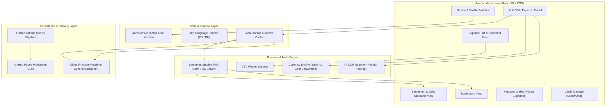
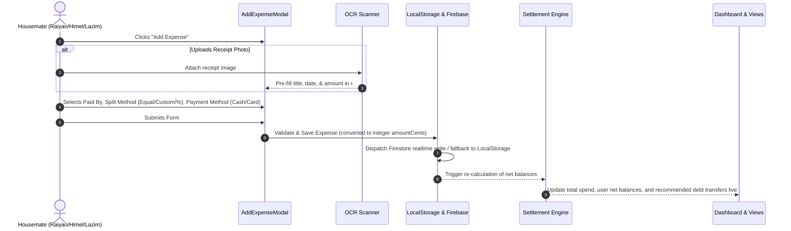
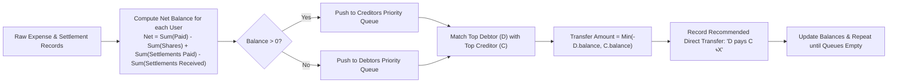
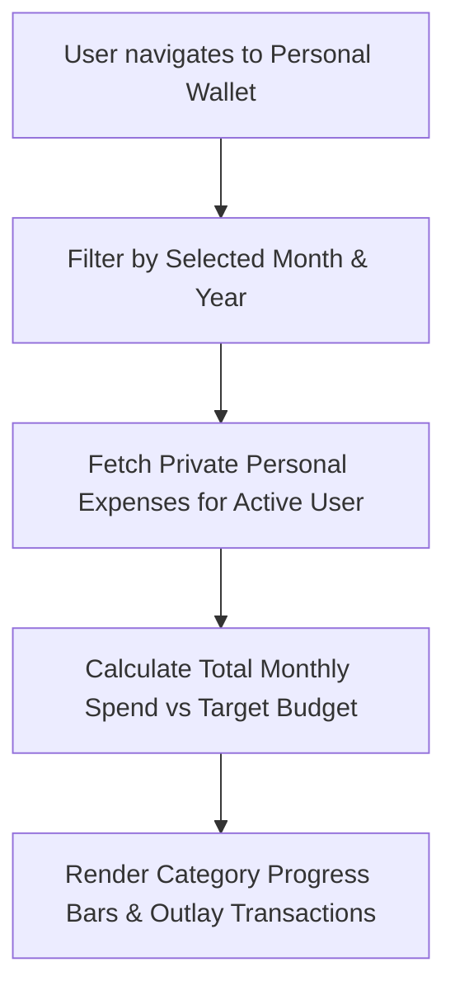
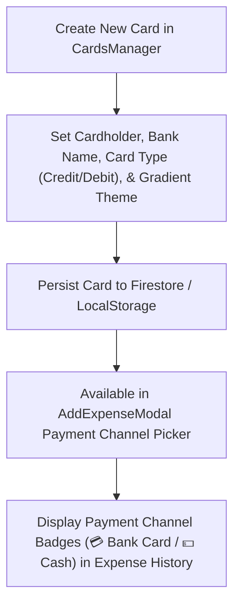

# GEMINI Project Flow & Execution Architecture

**Purpose**: Comprehensive mapping of application runtime execution, user interaction workflows, data pipelines, debt calculation lifecycle, and persistence flows for the Home Finance Tracker.  
**Last Updated**: 2026-07-29  
**Current Status**: Active & Verified  

---

## 1. Executive Summary & Overview

The **Home Finance Tracker** operates as a single-page reactive web application. It orchestrates user inputs, real-time cloud data synchronization, integer-cent financial balance tracking, optimal debt simplification algorithms, and responsive UI views.

---

## 2. System Flow Architecture



---

## 3. UI User Flow & Screen Layout Wireframes

### 3.1. Overall Application Shell & Navigation Wireframe

```
+---------------------------------------------------------------------------------------------------+
| 🏠 Home Finance Tracker                  [ EN | BN ]  (👤 Active User: Raiyan v)  [+ Add Expense] |
+-------------------------------+-------------------------------------------------------------------+
| SIDEBAR NAVIGATION (Desktop)  | MAIN CONTENT AREA                                                 |
|                               |                                                                   |
| [📊 Dashboard] (Active)       |  +-------------------------------------------------------------+  |
| [📝 Expenses]                 |  | 📊 HERO FINANCIAL STATS                                      |  |
| [⚖️ Settlement]                |  | Total Spend: ৳45,200  | Outstanding: ৳2,400 | Settled: ৳12,000 |  |
| [💼 Personal Wallet]          |  +-------------------------------------------------------------+  |
| [💳 Payment Cards]            |                                                                   |
| [📈 Monthly Analytics]        |  +-----------------------+ +-----------------------+              |
|                               |  | 👤 HOUSEMATE BALANCES | | ⚖️ RECOMMENDED SETTLE |              |
|                               |  | Raiyan : +৳1,800      | | Himel pays Raiyan   |              |
|                               |  | Himel  : -৳1,200      | |   ৳1,200.00           |              |
|                               |  | Lazim  : -৳600        | | [Mark as Settled]   |              |
|                               |  +-----------------------+ +-----------------------+              |
+-------------------------------+-------------------------------------------------------------------+
| MOBILE BOTTOM NAV:  [📊 Dash]  [📝 Expenses]  [➕ Add]  [⚖️ Settle]  [💼 Wallet]  [💳 Cards]        |
+---------------------------------------------------------------------------------------------------+
```

---

### 3.2. Add Expense Modal Wireframe (`AddExpenseModal.tsx`)

```
+---------------------------------------------------------------------------------------+
| ➕ Log New Expense                                                                [X] |
+---------------------------------------------------------------------------------------+
| Scope: ( • Shared Household Expense )   (   Private Personal Expense )                |
+---------------------------------------------------------------------------------------+
| Quick Presets: [ 🛒 Groceries ]  [ 📶 WiFi ]  [ ⚡ Utilities ]  [ 🍔 Eating Out ]     |
+---------------------------------------------------------------------------------------+
| Receipt Attachment (AI OCR Scanner):                                                  |
| +-----------------------------------------------------------------------------------+ |
| | 📷 Drag & Drop Receipt Photo here or click to browse (Auto-detects Amount & Title) | |
| +-----------------------------------------------------------------------------------+ |
|                                                                                       |
| Title / Description *               Amount (in Bangladeshi Taka ৳) *                  |
| [ Weekly Groceries Bazar       ]    [ ৳ 3,450.00                                   ] |
|                                                                                       |
| Paid By *                           Category *                                        |
| [ Raiyan (You)               v ]    [ 🛒 Groceries                               v ] |
|                                                                                       |
| Date *                              Payment Channel *                                 |
| [ 2026-07-29                 ]    ( • 💵 Cash )   (   💳 Bank Card: Dutch Bangla v )|
|                                                                                       |
| Split Method:                                                                         |
| [ Equal (33.3%) ]   ( Custom Amount ৳ )   ( Percentage % )                             |
|                                                                                       |
| Participants & Shares:                                                                |
| [x] Raiyan  (৳1,150.00)     [x] Himel  (৳1,150.00)     [x] Lazim  (৳1,150.00)          |
|                                                                                       |
| Repeat Bill: [ ] Auto-repeat ( [ Monthly v ] )                                        |
+---------------------------------------------------------------------------------------+
|                                                  [ Cancel ]    [ 💾 Save Expense ]    |
+---------------------------------------------------------------------------------------+
```

---

### 3.3. Debt Settlement & Simplification Wireframe (`SettlementView.tsx`)

```
+---------------------------------------------------------------------------------------+
| ⚖️ Debt Settlement & Minimizer                                                         |
| Solves optimal cash flow problem -> Reduces complex multi-party debts to N-1 transfers|
+---------------------------------------------------------------------------------------+
| DIRECT TRANSFERS REQUIRED (2 Actionable Steps):                                       |
|                                                                                       |
|  +---------------------------------------------------------------------------------+  |
|  | STEP 1: Himel  ==[ ৳ 1,200.00 ]==> Raiyan                                       |  |
|  | Debt Reason: Unsettled grocery & utility splits                                 |  |
|  |                                                        [ 💵 Mark as Settled ]   |  |
|  +---------------------------------------------------------------------------------+  |
|                                                                                       |
|  +---------------------------------------------------------------------------------+  |
|  | STEP 2: Lazim  ==[ ৳ 600.00 ]===> Raiyan                                       |  |
|  | Debt Reason: Internet bill share                                                |  |
|  |                                                        [ 💵 Mark as Settled ]   |  |
|  +---------------------------------------------------------------------------------+  |
+---------------------------------------------------------------------------------------+
| 📜 COMPLETED SETTLEMENT HISTORY AUDIT LOG                                             |
| Date       Payer    Recipient    Amount       Notes               Status              |
| 2026-07-25 Himel -> Lazim       ৳500.00     bKash TrxID #8291   [ Completed ✓ ]     |
| 2026-07-20 Lazim -> Raiyan      ৳1,500.00   Cash Handover       [ Completed ✓ ]     |
+---------------------------------------------------------------------------------------+
```

---

### 3.4. Personal Wallet Wireframe (`PersonalWallet.tsx`)

```
+---------------------------------------------------------------------------------------+
| 💼 Private Personal Wallet                                                            |
| Individual expense tracking & budget progress (Visible only to active user)          |
+---------------------------------------------------------------------------------------+
| 📅 Select Month/Year: [ 📅 July 2026 v ]        Target Budget: ৳15,000.00             |
|                                                                                       |
| +------------------------------------+ +--------------------------------------------+ |
| | 📊 MONTHLY PERSONAL OUTLAY         | | 🎯 BUDGET UTILIZATION                      | |
| | Total Spent: ৳8,450.00             | | [====================--------] 56.3%     | |
| | Remaining Budget: ৳6,550.00        | | Status: Healthy Spend                    | |
| +------------------------------------+ +--------------------------------------------+ |
|                                                                                       |
| PRIVATE EXPENSES LOG:                                                                 |
| Date       Title                   Category       Payment Method      Amount          |
| 2026-07-28 Coffee & Snacks         Personal       💵 Cash             ৳ 350.00        |
| 2026-07-26 Mobile Recharge         Utilities      💳 City Amex        ৳ 500.00        |
| 2026-07-22 New Headphones          Personal       💳 EBL Visa         ৳ 7,600.00      |
+---------------------------------------------------------------------------------------+
```

---

## 4. Core User Workflows & Data Lifecycle

### 4.1. Expense Logging Lifecycle



---

### 4.2. Debt Simplification & Settlement Flow

The debt simplification pipeline solves the **Minimum Cash Flow Problem** to reduce multi-party debt cycles down to at most $N-1$ direct transfers:



When a user clicks **"Mark as Settled"**:
1. A new `Settlement` record is created containing `fromUserId`, `toUserId`, and `amountCents`.
2. The settlement is pushed to Firestore/LocalStorage.
3. The engine recalculates net balances, bringing the debtor and creditor balances closer to ৳0.00.

---

### 4.3. Personal Wallet & Budget Workflow



---

### 4.4. Payment Cards Management Workflow



---

## 5. Relevant Files & Module Mapping

* **UI & Navigation**: [Navbar.tsx](file:///d:/Others/Google%20Antigravity/Home%20Finance/src/components/Navbar.tsx), [App.tsx](file:///d:/Others/Google%20Antigravity/Home%20Finance/src/App.tsx)
* **Views**: [Dashboard.tsx](file:///d:/Others/Google%20Antigravity/Home%20Finance/src/components/Dashboard.tsx), [ExpenseList.tsx](file:///d:/Others/Google%20Antigravity/Home%20Finance/src/components/ExpenseList.tsx), [SettlementView.tsx](file:///d:/Others/Google%20Antigravity/Home%20Finance/src/components/SettlementView.tsx), [PersonalWallet.tsx](file:///d:/Others/Google%20Antigravity/Home%20Finance/src/components/PersonalWallet.tsx), [CardsManager.tsx](file:///d:/Others/Google%20Antigravity/Home%20Finance/src/components/CardsManager.tsx)
* **Modals & Overlays**: [AddExpenseModal.tsx](file:///d:/Others/Google%20Antigravity/Home%20Finance/src/components/AddExpenseModal.tsx), [AuthModal.tsx](file:///d:/Others/Google%20Antigravity/Home%20Finance/src/components/AuthModal.tsx), [ConfirmModal.tsx](file:///d:/Others/Google%20Antigravity/Home%20Finance/src/components/ConfirmModal.tsx)
* **Core Logic & Math**: [settlementEngine.ts](file:///d:/Others/Google%20Antigravity/Home%20Finance/src/utils/settlementEngine.ts), [currency.ts](file:///d:/Others/Google%20Antigravity/Home%20Finance/src/utils/currency.ts)
* **Persistence & Synchronization**: [firebaseSync.ts](file:///d:/Others/Google%20Antigravity/Home%20Finance/src/utils/firebaseSync.ts), [storage.ts](file:///d:/Others/Google%20Antigravity/Home%20Finance/src/utils/storage.ts)
* **Design & Styling System**: [index.css](file:///d:/Others/Google%20Antigravity/Home%20Finance/src/index.css)

---

## 6. Architectural Decisions & Rationale

1. **Integer Cent Data Model (`amountCents`)**:
   * *Rationale*: IEEE 754 floating point arithmetic introduces rounding drift (e.g. `0.1 + 0.2 = 0.30000000000000004`). Converting all Taka inputs to integer cents (`Math.round(amount * 100)`) guarantees exact split calculations down to ৳0.01.

2. **Dual-Mode Persistence (Offline LocalStorage + Realtime Firestore)**:
   * *Rationale*: Provides instant web app load times without blocking on network authentication. If Firebase credentials are missing or unconfigured, the app operates seamlessly on LocalStorage cache. When connected, `onSnapshot` listeners deliver live multi-device updates across all housemates.

3. **Greedy Cash Flow Minimization**:
   * *Rationale*: Instead of requiring pairwise settlements between every individual housemate pair, the greedy algorithm sorts net balances and satisfies maximum debt/credit in single steps. For $N=3$ housemates, it guarantees settlement in at most 2 direct transactions.

---

## 7. Constraints, Risks & Future Considerations

* **Constraints**:
  * Designed specifically for the 3 fixed household members (Raiyan, Himel, Lazim), though data models support dynamic scaling if needed.
  * Taka (৳) is the fixed primary currency standard.

* **Risks**:
  * Concurrent offline edits on multiple devices without network sync could lead to sequence conflict if timestamping collides; mitigated by Cloud Firestore document ID collision avoidance.

* **Future Considerations**:
  * Push notifications for new expense entries or settlement requests.
  * Native PDF monthly audit statement rendering.

